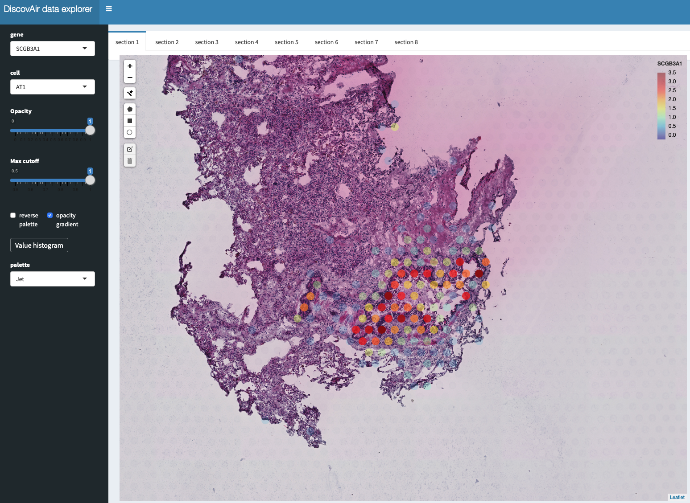
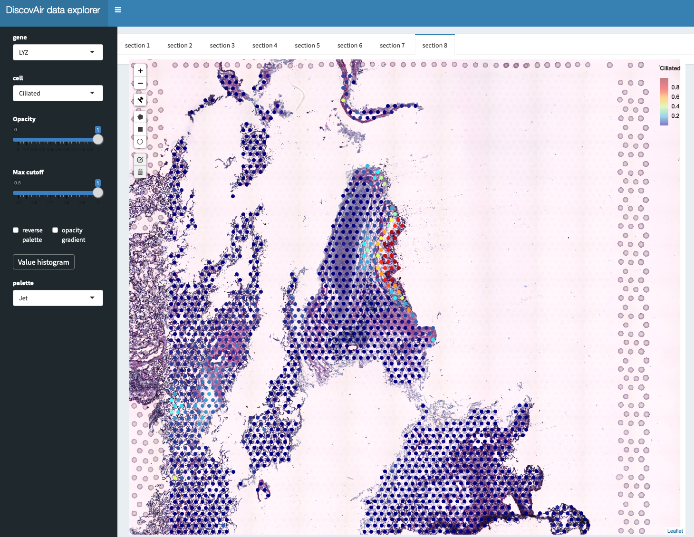

# DiscovAir spatial transcriptomics data explorer
With this app you can explore spatial transcriptomics data of sections from lung tissue.




# Installation
Clone the repo from the terminal by running:

```
git clone https://github.com/ludvigla/DiscovAir_data_explorer
```

To run the app, you first need to install the following R packages:

CRAN:
- ggplot2
- zeallot
- shiny
- shinydashboard
- RColorBrewer
- viridis
- scales
- shinyWidgets
- leaflet
- leaflet.extras
- htmlwidgets
- shinyBS

You can install the packages directly with the install-packages.R script from a terminal (tested on R v4.0.3):

```
Rscript install-packages.R
```

# Run the app
From RStudio, navigate to the cloned repository:

```
setwd("~/DiscovAir_data_explorer/{DATASET_NAME}")
```

Where DATASET_NAME is the name of the dataset specific directory (e.g. RNA_rescue).

You can then activate the app by running:

```
library(shiny)
```

```
runApp()
```

Or alternatively you can open the app.R file File->Open file->.../{DATASET_NAME}_app.R and then click on the Run App icon at the top of the script.

# How to use
When you open the app, you will see an H&E image of the first lung tissue section (`section 1`) overlaid by spots. The color of the spots correspond either to normalized gene expression or cell type proportions (will be added soon) which you can select from in the left panel. You can also switch tabs to visualize the other lung tissue section. 

Formatting options:
  * opacity : sets the (maximum) spot opacity to control transparency
  * maxcutoff : trim values based on a specific quantile, eg. a value of 0.99 will clip the values of the displayed value vector to the 99th quantile
  * reverse palette : should the color palette be reversed?
  * opacity gradient : should the spot opacity be scaled with the displayed value?
  * Value histogram : show a histogram of the selected value vector
  * palette : select a color palette

# Cell type mapping

Cell type proportions were estimated using the [stereoscope](https://github.com/almaan/stereoscope) deconvolution method. The scRNA-seq dataset was obtained 
from ["A spatial multi-omics atlas of the human lung reveals a novel immune cell survival niche"](https://doi.org/10.1101/2021.11.26.470108) by Madissoon et al. 

Spatial transcriptomics data obtained from LNG3 was paired with (1st/2nd generation airways) was paired with the "b_Bronchi.2.3 and "c_Bronchi.4" scRNA-seq data
and spatial transcriptomics data obtained from LNG5 (distal airways) was paired with the "d_LowLeftPar" and "e_TopLeftPar" scRNA-seq data.

Cell types with fewer than 50 cells were excluded from the scRNA-seq datasets and each cell type was downsampled to 250 cells to speed up computation. 

# Comments

If the wrong tiles are loaded in the viewer, you might have to restart and proceed in a clean R session. 
